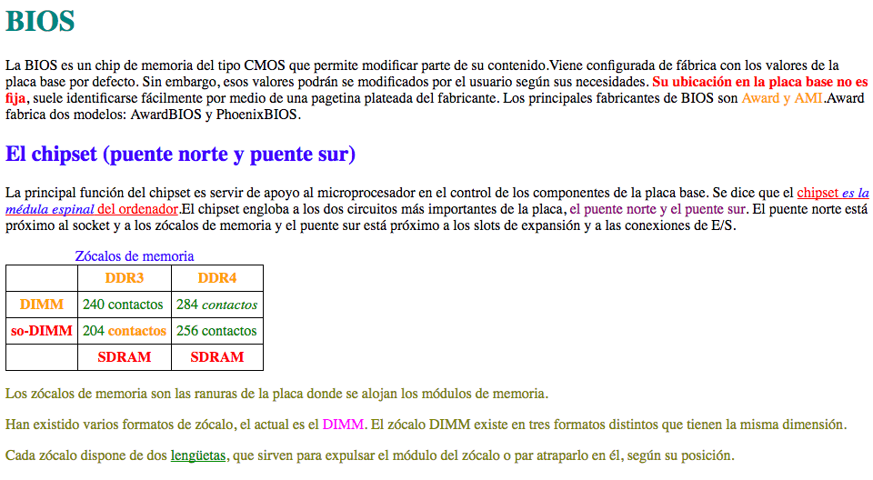
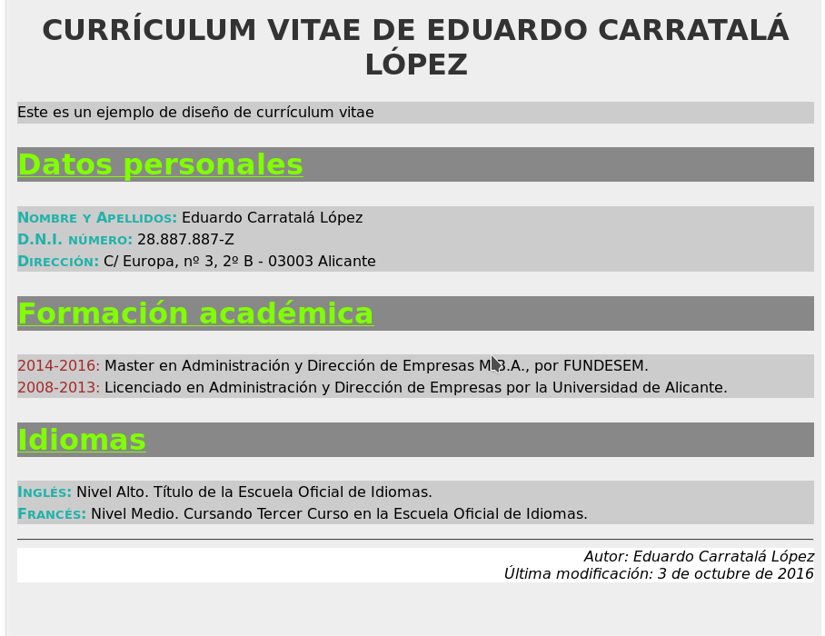
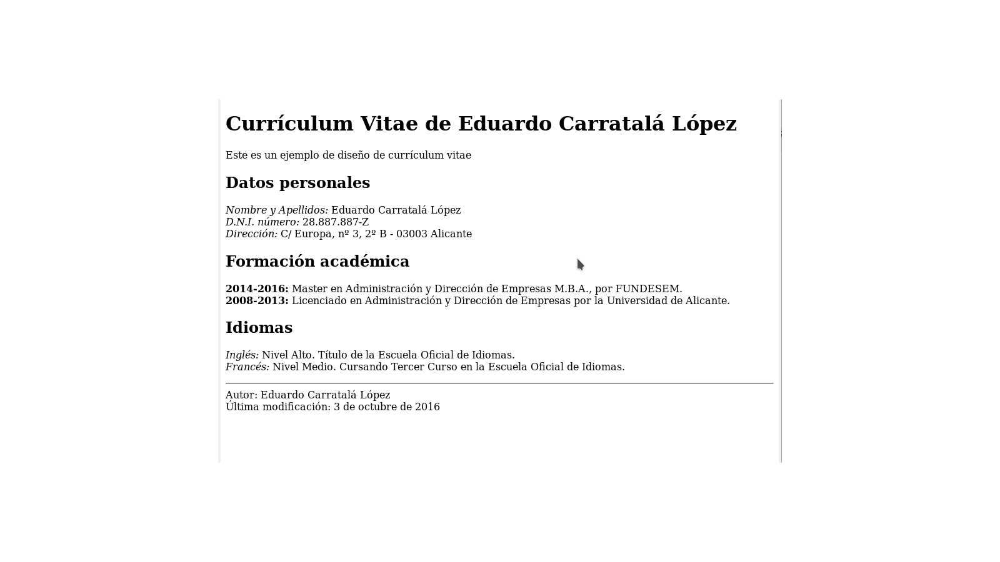


## Ej1. Práctica de selectores CSS  (**2 pts**)

Crea un documento ****HTML**** cunha páxina web en ****HTML5**** que reproduza en contido e aspecto o que se mostra na seguinte imaxe, empregando unha folla de estilos ****CSS externa****. 

****O********J********O****: no se pueden poner elementos duplicados, i.e, no podemos poner 2 veces DIW si no una vez DIW si ocupa 2 horas seguidas.

_Opcional_: añadir estilos para hacerla visualmente más agradable.
O texto está dispoñible sen formato no [ficheiro adxunto](../recursos/Texto_tarefa_selectors.txt)

Emprega a seguinte regra de estilos para a táboa:
`table, tr, th, td {border:1px solid #000; border-collapse:collapse; padding:5px;}`
Escolle as cores do xeito máis semellante entre os seguintes: 

Entrega o ficheiro HTML e mais o ficheiro CSS

## Ej2. MAQUETAR UN CURRICULUM  (**3 pts**)

Cree un documento HTML chamado **curriculum.html** cunha folla de estilo asociada almacenada nun ficheiro externo chamado **curriculum.css**.
O navegador debería mostrar un resultado igual ao que se mostra na captura de pantalla contida na imaxe

Estas son as reglas de estilo que tes que aplicar:
1. A tipografía será da familia xenérica sans serif.
2. A cor de fondo da páxina será #EEEEEE
3. O resto das cores a utilizar son as seguintes:
   * Título principal: #333333 (cor de texto)
   * Títulos de seccións: #7FFF00 (cor de texto) e #888888 (cor de fondo)
   * Cor de fondo de contenido de seccióons: #CCCCCC
   * Cor de texto de tipos de datos personais (nome, DNI, dirección) e idiomas (inglés, francés): #20B2AA
   * Cor de texto de datas de formación académica: #A52A2A
   * Cor de fondo do elemento que contén o texto co nome do autor e a data da última modificación: branco

NOTA 1: Como axuda para estruturar o documento mediante HTML, adxuntase unha captura de pantalla da mesma páxina sen aplicar ningún estilo (só os aplicados por defecto polo navegador). Esta captura está contida na imaxe 
NOTA 2: Achégase no arquivo [curriculum_sin_marcar](../recursos/curriculum_sin_marcar.html) o texto da páxina (sen marcar).

A entrega desta tarefa farase mediante **2 ficheiros, un HTML e outro CSS**.

## Ej3. Web dunha pizzería (**3 pts**)

### Estrutura semántica

 Crea documento HTML cunha páxina web de inicio para unha pizzería co nome index.html. O contido desta páxina debe cumprir as seguintes especificacións: 
 - O título que debe verse no navegador é “Pizzería Compostela”
 - O título que debe aparecer na cabeceira é “Pizzería Compostela”
 - Debaixo do título debe aparecer un subtítulo, asociado a el, co título “As mellores pizzas de Santiago”
 - No apartado que permite navegar polo sitio web haberá unha lista cos seguintes opcións:
 -- “Inicio”
 -- “Fai o teu pedido” (que enlace á páxina pedido.html que veremos)
 - Nesta páxina de inicio verase información sobre as distintas especialidades de pizza. A información de cada especialidade será:
	 - Título co nome de cada pizza
	 - Descrición dos ingredientes que leva a pizza correspondente
 - A pé de páxina aparecerá o nome da pizzería e a dirección. 
 
Os contidos deben estar estruturados para que teñan sentido semántico. 
Fai uso duns estilos mínimos (ver exemplo de  para poder visualizar a estrutura do documento.

## Ej4. Formulario HTML5  (**2 pts**)

Implementa nun ficheiro html o código fuente para o seguinte formulario con HTML 5 facendo uso dos [HTML5 input types](https://www.w3schools.com/html/html_form_input_types.asp) oportunos.

Podes usar a seguinte aplicación para comprobar que o código HTML é válido: [https://validator.w3.org/](https://validator.w3.org/)

